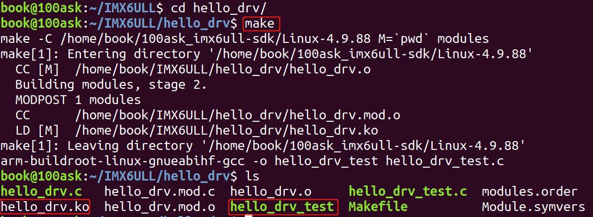
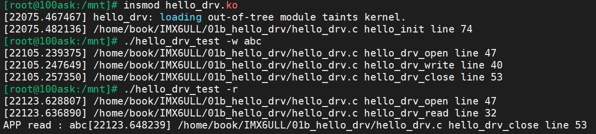

# 实验准备

源码文件夹路径：`IMX6ULL/hellO_drv`


## 1.Makefile说明

```makefile

# 1. 使用不同的开发板内核时, 一定要修改KERN_DIR
# 2. KERN_DIR中的内核要事先配置、编译, 为了能编译内核, 要先设置下列环境变量:
# 2.1 ARCH,          比如: export ARCH=arm64
# 2.2 CROSS_COMPILE, 比如: export CROSS_COMPILE=aarch64-linux-gnu-
# 2.3 PATH,          比如: export PATH=$PATH:/home/book/100ask_roc-rk3399-pc/ToolChain-6.3.1/gcc-linaro-6.3.1-2017.05-x86_64_aarch64-linux-gnu/bin 
# 注意: 不同的开发板不同的编译器上述3个环境变量不一定相同,
#       请参考各开发板的高级用户使用手册

KERN_DIR = /home/book/100ask_imx6ull-sdk/Linux-4.9.88

all:
	make -C $(KERN_DIR) M=`pwd` modules 
	$(CROSS_COMPILE)gcc -o hello_drv_test hello_drv_test.c 

clean:
	make -C $(KERN_DIR) M=`pwd` modules clean
	rm -rf modules.ordera
	rm -f hello_drv_test

obj-m	+= hello_drv.o
```


## 2.编译命令说明

在实验目录下输入如下命令来编译驱动模块：




## 3.程序运行结果

通过NFS将编译好的`hello_drv.ko`,`hello_drv_test`拷贝到开发板中

```
[root@100ask:/mnt]# insmod hello_drv.ko
[root@100ask:/mnt]# ./hello_drv_test -w abc
[root@100ask:/mnt]# ./hello_drv_test -r
```

实验现象：


